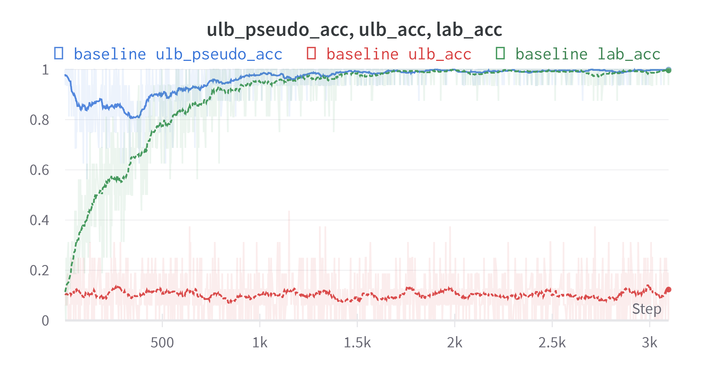
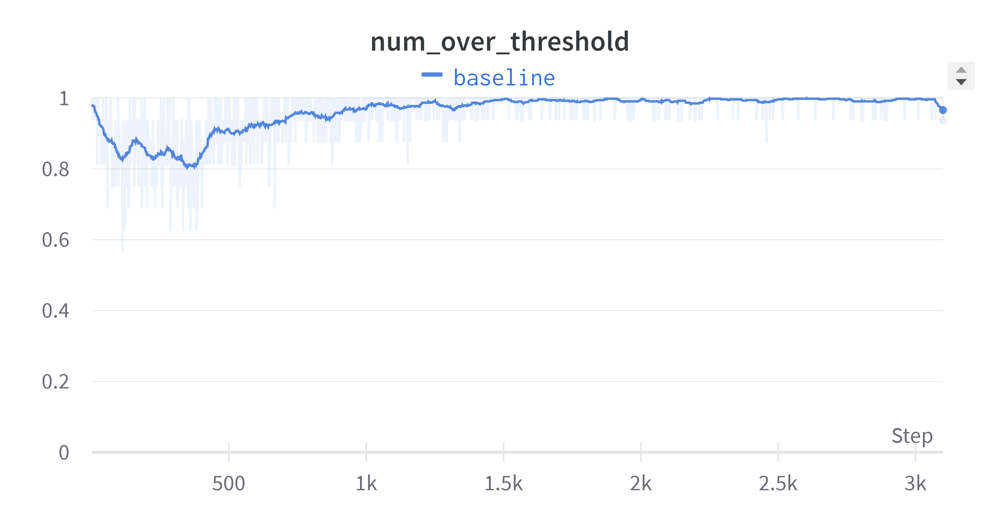
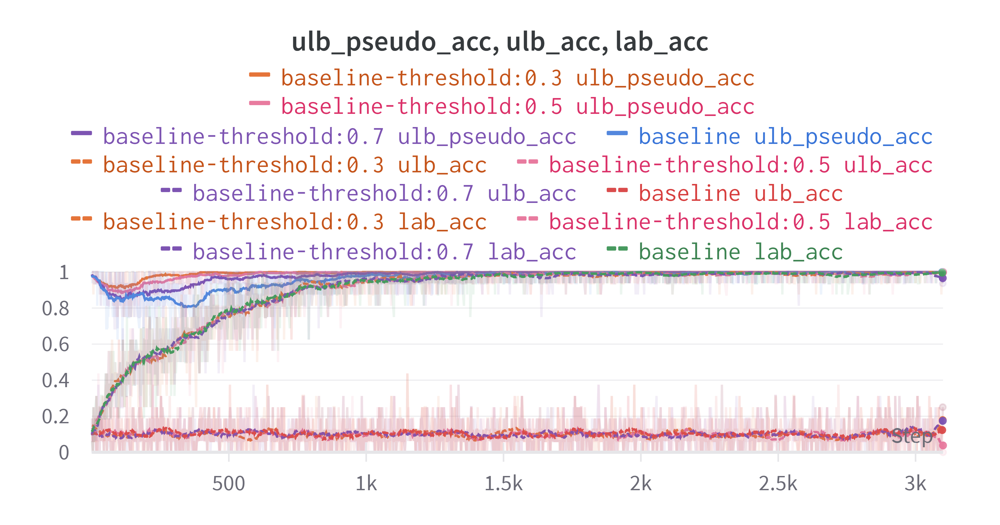
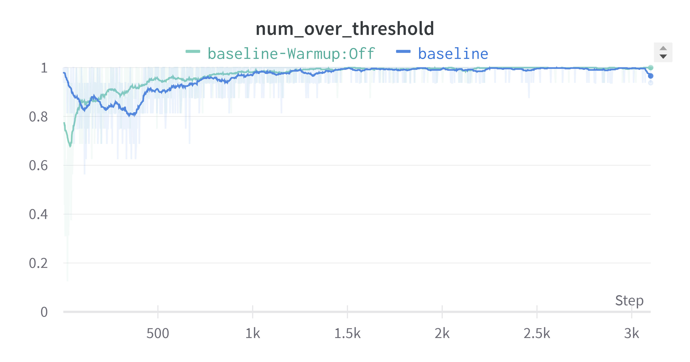
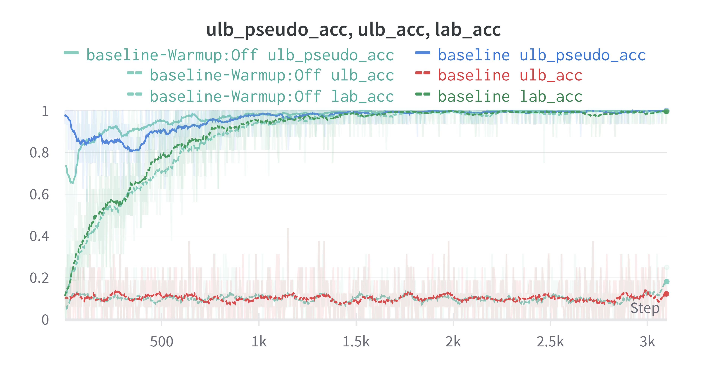
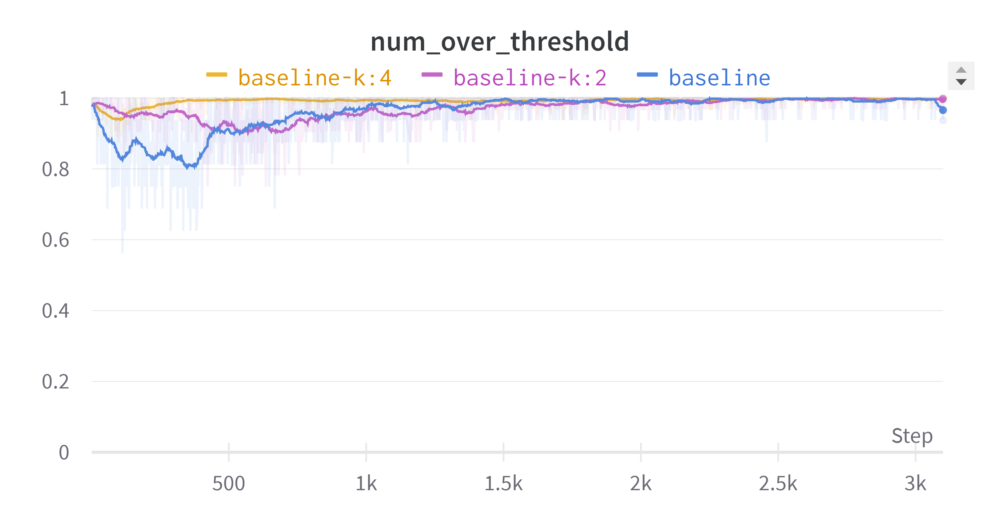
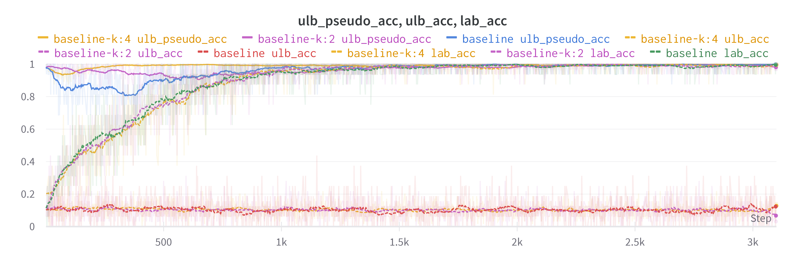
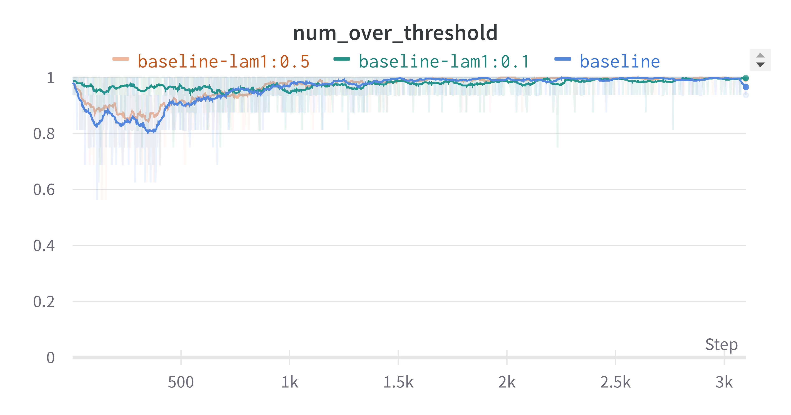
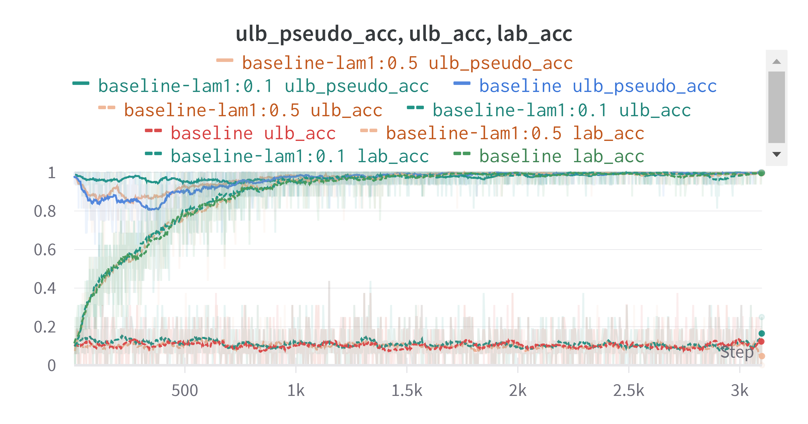
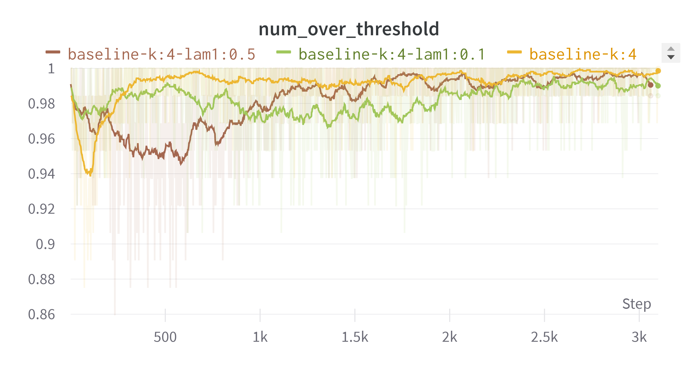

# 고려대학교 산업경영공학부 대학원 Business Analytics 수업 과제 5 : Semi-Supvervised Learning

- 본 레포지토리는 수업 시간에 다룬 다양한 Semi-Supervised 방법론 중 FlexMatch 구현과 실험을 담고 있다. 
- [FlexMatch](https://arxiv.org/abs/2110.08263)는 Semi-Supervised Learning의 한 방법론으로, Unlabeled Data와 Labeled Data를 함께 활용하여 학습을 진행하는 방법론이다. 
- FlexMatch가 각 데이터를 활용하는 방식은 다음과 같다. 
    1. Labeled Data는 기존의 Supervised Learning 기법을 이용하여 학습한다. 이때, 손실함수는 Cross Entropy를 사용한다. 
    2. Unlabeled Data는 각각 다른 강도의 Augmentation을 가한 Weak/Strong Augmentated Data(이하 Weak Aug, Strong Aug) 를 활용한다. 자세한 방법론은 다음과 같다. 
    2.1. Weak Aug를 이용하여 Pseudo Label을 생성한다. 이때, Weak Aug의 Logit이 Max Threshold를 넘는 수를 계산하여, 이 값이 최대인 클래스에 비해 각 클래스에 대해 Threshold를 조절한다.
    2.2. Strong Aug는 Weak Aug를 통해 생성된 Pseudo Label을 통해 학습한다. 이때, 손실함수는 Cross Entropy를 사용한다. 
- 레포지토리의 구조는 다음과 같다. 
    ├──dataset : 원본 데이터셋 및 Semi-Supvervised Learning 환경에 맞도록 가공한 데이터셋 
    ├──configs : 실험을 위해 사용한 각 configuration 파일
    ├──src : FlexMatch 구현을 위한 코드
    ├────dataset.py : SSL을 위해 Labeled/Unlabeled/Test DataSet Class 정의 파일
    ├────RandAug.py : Weak/Strong Augmentation을 위한 Image Augmentation 코드 
    ├────Trainer.py : 학습을 위한 Trainer 정의 파일 
    ├────utils.py : FlexMatch에서 제안하는 Curriculum Pseudo Labeling 구현 파일

- 전반적인 코드는 기존의 Image Classification 분야의 Supervised Learning 환경에서의 학습과정과 동일하다. 다만, Pseudo Labeleing 과정이 FlexMatch의 핵심으로 구현 방식을 살펴보자. 

논문에서 제안하는 방법론은 다음과 같이 코드로 표현할 수 있다. (아래 코드는 src/utils.py의 CPL_Labeler 코드를 설명을 위해 변경하였다.)
모델은 **Weak Aug**에 대한 **logit 분포**와 **Strong Aug**에 대한 **logit 분포**를 산출한다. 
```python
    # 1. Weak Logit에 대해 Max Threshold를 넘는 값을 확인한다. 
    over_max_threshold = weak_logits > self.max_threshold
    # 2. 각 클래스에 대해 Max Threshold를 넘는 값의 수를 확인한다. 
    num_over_max_threshold = over_max_threshold.sum(dim = 0)
    # 3. 가장 많은 수의 데이터가 Max Threshold를 넘은 횟수를 확인한다. 
    max_num = num_over_max_threshold.max()
    # 4. 학습 초기 대부분의 데이터가 Threshold를 넘지 못할 것을 대비하여, Threshold warmup을 고려한 denominator를 계산한다. 
    deno = max_num if max_num > bsz - max_num else bsz - max_num
    # 5. 각 클래스 별 최대 횟수와 비교한 비율을 계산한다. 
    beta = num_over_max_threshold / deno
    # 6. 5에서 산출한 비율을 바탕으로 Max Threshold 대비 각 클래스 별 Flexible한 Threhold를 산출한다. 
    flex_threshold = self.max_threshold * beta
    # 7. Non-Linear Mapping을 통해 학습과정의 안정성을 도모한다. 
    flex_threshold = flex_threshold/(2-flex_threshold)
    # 8. 각 데이터 중 Threshold를 넘는 Weak Aug만 Pseudo Lable로 사용한다. (-100은 Cross Entropy Loss 계산 시 무시되는 Flag이다.)
    pseudo_labels = torch.tensor([pred if logits.max() > threshold[pred] else -100 for logits, pred in zip(weak_logits, weak_preds)]) # -100 is a ignore index for Cross Entorpy Loss; not calculated in loss
    # 9. 8에서 산출한 Pseudo Label을 Label로 사용하여, Strong Aug를 이용한 예측에 대한 손실함수를 계산한다. 
    ulb_loss = loss_fn(ulb_strong_output, pseudo_labels)

```


## 1. 실험환경 
### 1-1. 데이터셋

본 실험은 STL 10 데이터셋을 이용했다. 해당 데이터셋은 본래 소수의 Labeled 데이터와 다수의 Unlabled 데이터가 존재할 경우의 이미지 모델 평가를 위해 제안된 방법론이다. 본 튜토리얼에선 엄밀하게 Unlabeled Data도 Uniform Distribution을 만족시키고, Labeled Data의 수를 제한하고자, 기존의 Labeled Data에서 Labeled 및 Unlabeled Data를 분리했다. 또한, 기존의 다양한 Semi-Supervised Learning 연구방법론과 동일하게, Test 셋은 그대로 활용하여, 모델의 성능 평가 시 대수의 법칙을 따르도록 했다. 


### 1-3. 관찰 지표 설명 
실험을 진행하면서 공통적으로 관찰한 지표는 다음과 같다. 
- Labeled Accuracy : Labeled 데이터의 실제 label을 활용한 정확도
- Unlabeled Accuracy : Unlabeled 데이터의 실제 label을 활용한 정확도
- Unlabeled Pseudo Accuracy : Unlabeled 데이터가 Weak Aug를 통해 생성한 Pseudo Label에 대한 정확도
- Labeled Loss : Labeled 데이터의 CELoss
- Unlabeled Loss : Unlabeled 데이터의 Pseudo Label에 대한 CELoss
- \# of Over Threshold : Strong Aug 중 Threshold를 넘은 데이터 비중

### 1-4. Model
Foundation Model로 ResNet18을 이용하였다. 

### 1-5. 시각화 
모든 시각화 자료는 Smoothing 기법을 통해 결과물을 보다 명시적으로 보이도록 했다. 모든 실험 기록은 [WandB](https://wandb.ai/text-ssl/FlexMatch?workspace=user-jaehee_kim)를 통해 확인할 수 있다.

## 2. 실험 1 : Consistency Regualization 관련
### 2-1. 기본 실험
labeled : unlabeled = 1 : 1의 비중으로 학습을 진행하면서 전체 경과를 살펴보도록 하자. 즉, batch size=16이라면, mini-batch 한 개당 labeled 데이터 16건, unlabeled 데이터 16건이 사용되는 것이다. 



위 그림은 최종 성능 24.5%를 기록한 baseline 모델의 학습 과정 상 Labeled, Unlabeled, Unlabeled Pseudo Accuracy 변화를 시각화 자료이다. 위 그림을 보면 매우 놀라운 점이 한가지 관찰된다. 
**Unlabeled Accuracy가 Random Guessing과 크게 달라지지 않음에도 불구하고, Unlabeled Pseudo Accuracy가 지속적으로 나아지고 있다.**


이와 대조적으로 위 그림에서 볼 수 있듯이, 학습 초기부터 WarmUp 덕분에 상당수의 Unlabeled Data가 Threshold를 넘는 모습을 보이고 있다. 

이는 실제 학습에 있어, Unlabeled Data에 대해 모델이 실제 레이블을 예측하는 과정을 통해 학습하는 것이 아니라는 점을 의미한다. 즉, Consistency Regularization이라는 이름처럼, Strong/Weak Aug 간 동일한 예측을 산출하도록 모델이 학습되는 것이 중점이라고 할 수 있다. 하지만 이러한 가정을 위해선 두가지 실험이 추가적으로 필요하다. 이어 진행하도록 하겠다. 

### 2-2.  Max Threshold 별 성능 변화
위 결과는 Max Threshold가 너무 높아 학습 초기부터 유의미한 Unlabeled Data 예측값이 온전히 Pseudo Label로 사용되지 못해 발생했을 가능성이 있다. 그러므로, Max Threshold를 0.3부터 0.9까지 변화하며 실제 성능 및 Accuracy Plot이 변화하는 모습을 관찰해보자. 

위 실험 결과를 살펴보면, Max Threshold의 영향력은 크지 않음을 알 수 있다. 즉, 다음과 같은 분석이 가능하다. 
- Max Threshold가 낮아지면, Unlabeled Pseudo Accuracy가 학습 초기에 급격히 상승하는 경향을 보인다. 이는, Threshold에 도달하지 못한 Weak Aug를 이용하여 Pseudo Label이 생성되기 때문으로 보인다. 
- Max Threshold의 변화에도 불구하고, Unlabeled Accuracy는 Random Guess에서 벗어나지 않는다. 즉, 모델은 Unlabeled Data에 대해 별도의 학습을 진행하고 있음을 알 수 있다. 
- 성능 면에 있어서도, Max Threshold를 낮추는 것은 도움이 되지 않았다. 성능은 다음과 같았다. 

| max threhold     | 0.9  | 0.7  | 0.5  | 0.3  |
|------------------|------|------|------|------|
| Test Accuracy(%) | 24.5 | 22.7 | 22.5 | 17.6 |

즉, 실제로 Pseudo Label로 동작할 수 있는 Weak Aug를 엄격한 Threshold를 통해 필터링하는 것이 학습에 도움이 되었다. 

### 2-3. Warm Up 제거 실험
FlexMatch는 Warm Up을 통해, 학습이 충분히 진행되지 않은 초기에 전체 데이터에 비해 적은 데이터만 Threshold를 넘을 경우, 분모 항을 변경하여 많은 Unlabeled Data가 학습에 반영될 수 있도록 한다. 하지만, 이러한 장치로 인해, 학습 초기에 불안정한 Pseudo Label이 생성되고, 이 점이 이후 학습에서도 Unlabeled Data에 대해 Random Guessing이 진행될 수 있다. 



Warm Up을 제거하고 실험을 진행한 결과는 위와 같다. 위 도표는 Warmup 여부에 따른 Threshold 이상의 데이터 수를 시각화 한 것이다. 위 그림에서 WarmUp 적용에 따른 확연한 변화를 관찰할 수 있다. 

- 학습 초기 WarmUp 제거 시 비교적 적은 데이터가 Threshold를 넘는 모습을 보인다. 
- 학습 후기로 갈 수록 WarmUp에 따른 차이가 적어진다. 

이러한 현상은 지속적으로 관찰했던 Accuracy Plot을 통해서도 확인할 수 있다. 


위 장표에서도 확연히 보이는 차이점은 Unlabeled Pseudo Accuracy 뿐이다. 즉, Warm Up을 통해서, 학습 초기에 실제로 유의미한 Pseudo Label만 생성되고 있다는 것을 알 수 있다.

실제로 성능에 있어서도, 아래와 같이 Warmup을 제거할 경우 급락하는 경향을 보였다. 

| max threhold     | 0.9  | 0.7  | 0.5  | 0.3  | 0.9+WarmUpX  |
|------------------|------|------|------|------|------|
| Test Accuracy(%) | 24.5 | 22.7 | 22.5 | 17.6 | 18.6 |

**결론 1 : Unlabeled 데이터에 대해 Labeled 데이터와 같이 Pseudo Label에 대한 Supverised Learning을 수행하지 않는다. 오직 Unlabeled 데이터는 Consistency Regualarization용으로 사용될 뿐이다.**

이러한 결론 1은 Augmentation의 영향으로 볼 수 있다. Weak Aug와 달리 Strong Aug는 Labeled 데이터에 적용되지 않는다. 이로인해 모델은 실제로 Strong Aug에 대한 Supervision을 학습할 수 없고, 이는 모델에게 Consistency Regualarization을 강제한다고 볼 수 있을 것이다. 

## 3. 실험 2 : Additional Supervision 관련
만약 모델이 실제로 Unlabeled Data로부터 추가적인 학습 신호를 받고 있다면, 이는 Labeled 데이터로부터 오는 신호(supervised loss)에 비해 어느정도 수준까지 커질 때 유의미한 것일까? 이를 살펴보도록 하자. 

### 3-1. K 변화 실험
k, 즉 Labeled 데이터 당 Unlabeled 데이터의 비율은 Semi-Supervised Learning에 있어 매우 중요한 변수이다. 현실세계에도 Labeled 데이터에 비해 Unlabeled 데이터가 수백배 많을수도 있고, 비슷한 양이 존재할 수도 있다. 또한, 실제 학습에 있어서도, k가 커지면, 동일 배치 내 Unlabeled 데이터가 늘어나 배치 사이즈가 커지는 효과가 발생하기도 한다. K의 크기를 변화하면서 성능 변화를 관찰해보자. 



K에 따른 가장 큰 차이점은 학습 초기의 Threshold를 넘는 데이터의 비중이다. K가 커지면서, batch size가 증가되는 효과가 발생했고, 이로인해, Threshold를 넘는 데이터가 학습 초기부터 많은 것을 확인할 수 있었다. 



Accuracy Plot을 확인해보면, Threshold를 넘는 데이터 수와 별개로 지속적으로 Unlabeled Accuracy가 Random Guessing에 머무는 것을 알 수 있다. 또한, Threshold를 넘는 데이터의 수가 초기에 많아지자 덩달아 Unlabeled Pseudo Accuracy 역시 초기에 높아진 것을 확인할 수 있다. 

| K                | 1    | 2    | 4    |
|------------------|------|------|------|
| Test Accuracy(%) | 24.5 | 25.2 | 23.9 |

하지만 실제 성능에 있어서는, K의 수가 커진다고 학습에 무조건 도움이 되지 않았다. 이는 Consistency Regularization에 모델이 너무 과도하게 학습되어, 실제 Supervised Learning을 통한 학습에 방해가 되고 있는 것으로 추측할 수 있다. 

### 3-2. Consistency Regularization Weight 변화

만약 위와 같은 상황이라면, K를 늘리면서 Consistency Regualarization Weight(lambda 1)를 줄인다면, 학습 효과를 잘 발휘할 수 있지 않을까? 해당 실험을 마지막으로 최종 결론을 도출해보도록 하자. 



위 그림은 baseline 모델의 lambda1 변화에 따른 Threshold를 넘는 Unlabeled 데이터의 수를 나타낸다. 매우 흥미롭게도, lambda1이 작을 수록 학습 초기에 Threshold를 넘는 데이터가 많은 것을 볼 수 있다. 



하지만 이러한 경향성이 Unlabeled Accuracy에 큰 영향을 미치지 못했다. 이는 Lambda 1을 조정하더라도 Unlabeled에 대해 모델이 Supervised Learning과 비슷한 학습을 하지 않는다는 반증이라 할 수 있다. 

| K                | 1    | 1    | 1    
|------------------|------|------|------
| lam1             | 1    | 0.5  | 0.1  
| Test Accuracy(%) | 24.5 | 23.1 | 33.8 

학습 과정에서 변화로 실제 성능을 추론하기는 힘들다는 점을 위 성능 표를 통해 알 수 있다. 학습 과정에서 Lambda 1이 0.1일 때, 가장 Threshold를 많이 넘었고, 그 다음 순위가 Lambda 1이 0.5일 때였다. 하지만 실제 성능에서는 Lambda = 0.1, 1, 0.5 순으로 높은 성능을 기록한 것을 볼 수 있다. 
즉,  Consistency Regularization이 Auxiliary Loss와 같이 동작할 때, 높은 성능을 보인다고 짐작할 수 있다. 하지만, FlexMatch 논문에선 Lambda 1을 1로 고정한 것을 고려하면, 매우 직관적 해석이 어려운 상황임을 알 수 있다. 


위 그림은 K=4일 때, 동일한 lambda에 대해 실험한 결과이다. 더욱 혼란스러운 점은 lambda가 0.1일 때, 학습 초기에 가장 많은 데이터가 Threshold를 넘었지만, lambda가 0.5로 중간일 때, 학습 초기에 Threshold를 넘는 데이터가 적어진다는 점이다. 이는 특정 경향성이 존재하기 보다, 데이터와 하이퍼 파라미터에 매우 의존적으로 학습 환경이 구성되어야 함을 암시한다고 볼 수 있다.

| K                | 1    | 1    | 1    | 4    | 4    | 4    |
|------------------|------|------|------|------|------|------|
| lam1             | 1    | 0.5  | 0.1  | 1    | 0.5  | 0.1  |
| Test Accuracy(%) | 24.5 | 23.1 | 33.8 | 23.9 | 26.9 | 34.8 |
|                  |      |      |      |      |      |      |

실제로 학습 결과를 살펴보면, lambda가 0.1일 때 두 K 모두에서 제일 좋은 성능을 보이고 있다. 이를 통해 다음과 같은 결론을 얻을 수 있다. 

**결론 2 : 학습 과정에서 Consistency Loss를 너무 많이 반영할 경우 오히려 모델 학습에 방해될 수 있다.**

## 4. 결론
지금까지 FlexMatch를 통해 모델이 Unlabeled 데이터에서 학습하는 신호를 자세히 분석해보았다. 그 결과를 요약하면 다음과 같다. 
- Unlabeled 데이터에 대해 Labeled 데이터와 같이 Pseudo Label에 대한 Supverised Learning을 수행하지 않는다. 오직 Unlabeled 데이터는 Consistency Regualarization용으로 사용될 뿐이다.
- 학습 과정에서 Consistency Loss를 너무 많이 반영할 경우 오히려 모델 학습에 방해될 수 있다.

즉, 당초 예상과 다르게 Semi-Supervised Learning 방법론에서 모델은 Unlabeled 데이터에 대해 Supervised Learning과 다른 신호를 학습하고 있으며, 해당 신호의 크기가 적절할 때 가장 좋은 성능을 보이는 것을 알 수 있었다. 
향후 Strong Augmentation의 강도에 따른 성능 평가 및 보다 다양한 Foundation 모델 구조와 크기 별 성능 평가를 통해 모델 학습 매커니즘을 규명할 수 있을 것으로 기대된다. 